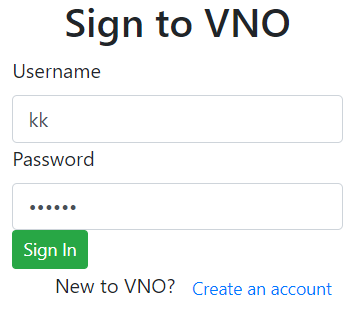
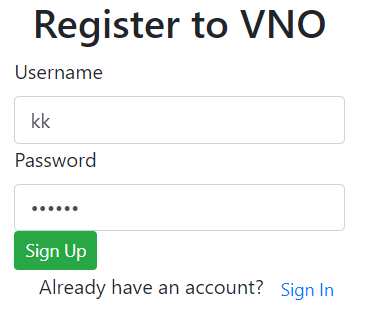
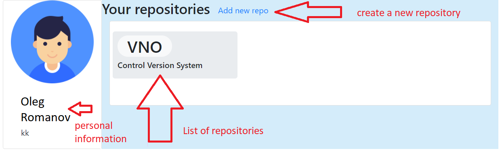
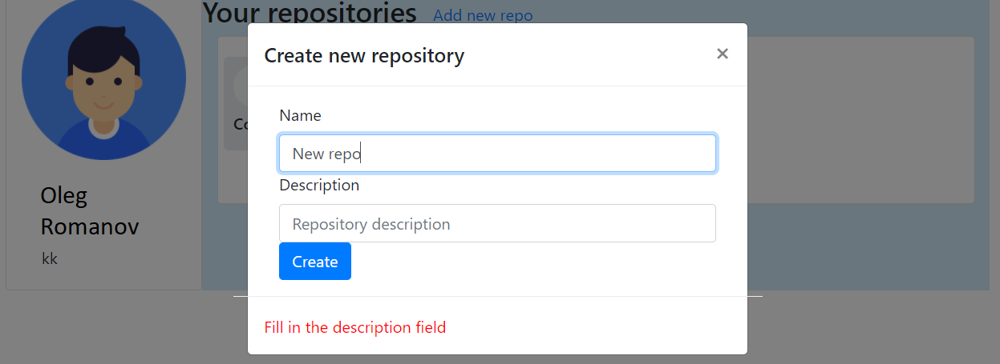
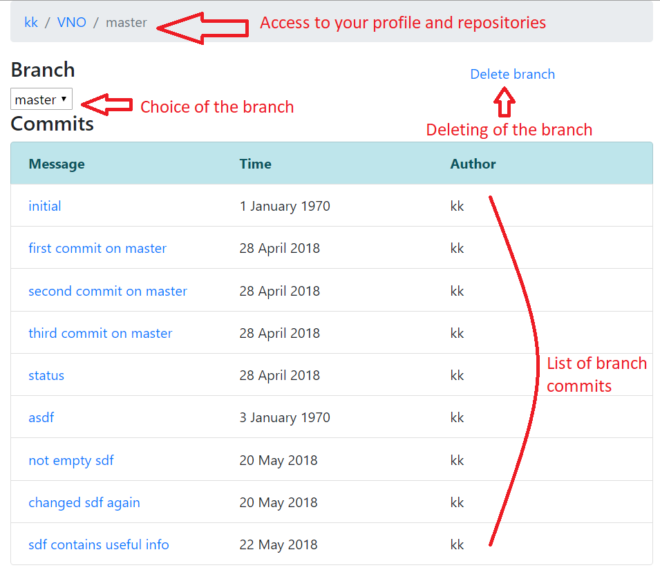
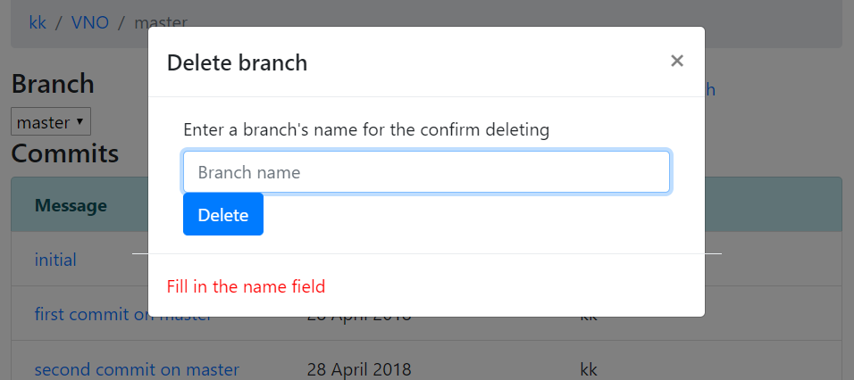
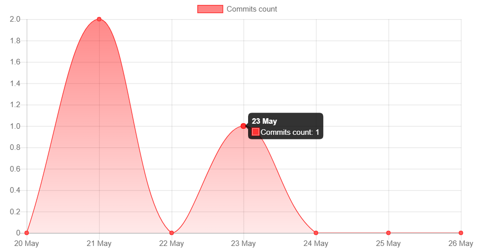
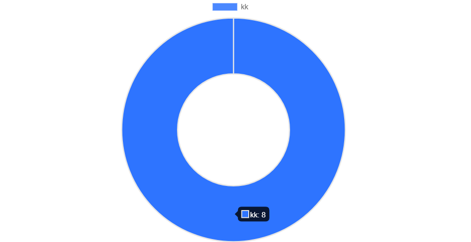
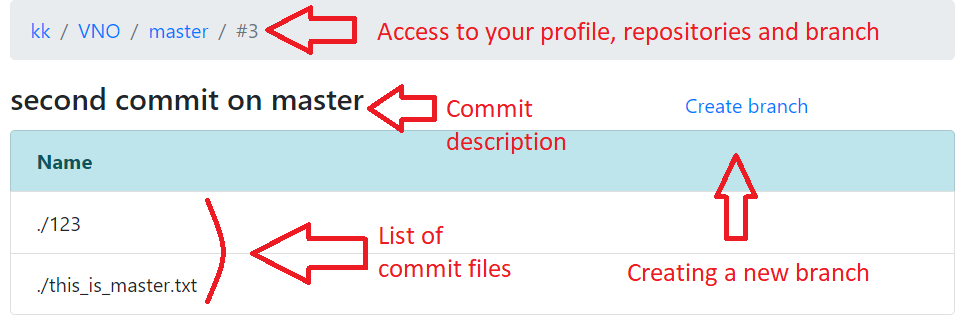
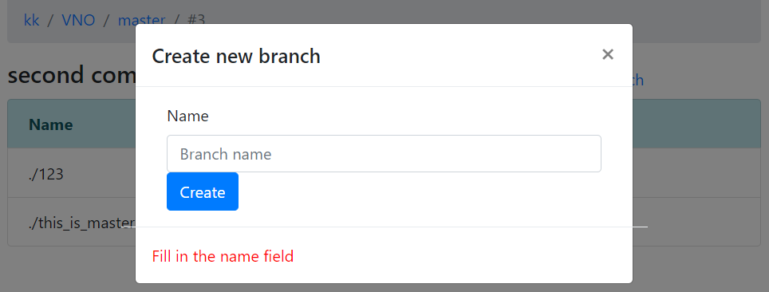

# Description

It is web client for CoVNO (Control version system from Valera, Nikita and Oleg), written by Vue.js framework.

- [Console client](https://github.com/Programmer74/vno-cli)
- [Server](https://github.com/ValeriyKr/vno)

# Features:

---
### Authorization page
---

---
### Registration page
---

---
### On profile page user can view list of your repositories and your personal information.
---

---
### Or can create a new repository.
---

---
### After select repository user can choose right branch and view list of commits. Then user can switch it
---

---
### Or remove if necessary.
---

---
### At the bottom of this page is a chart of the commits history of the current branch for the week.
---

---
### And donut chart of the commits of different users of the current branch for all time.
---

---
### Also can select any commit and view list of files.
---

---
### At his wish user can branch a new branch from this commit.
---

